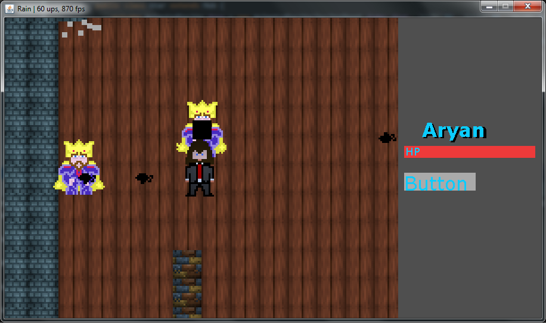

# Rain, a 2D Game

## Table of Contents:

 1. [Introduction](#intro)
 2. [Screens](#screens)
 3. [List of topics covered in series](#topic)
 4. [Mess around with Rain and get started](#messaround)
 5. [About Author](#about)

## Introduction: 
Rain is a 2D Game written in pure java, without any external dependencies or engines. More about the series and the orignal author [here](#about).

This is my code-along version, in which I've written the engine and game while following along the series. There are a few things I've done differently, as a matter of preference, but it's largely the same.

If you find the series interesting and want a guide alongside every video and see changes, the commits have a tag attached to them in form of 
#(video_number), 

> (PS - This started from ~#20.

It is quite similiar, or atleast developed by keeping "Realm of the Mad God" in mind and thus, you'll see a lot of similiarities. This is not a complete game, but rather a project to learn and try many important game programming aspects.

Only requirement for Rain to run on your system is to have Java installed.

> Keep in mind that the initial video was released in 2012, so the code
> is highly backwards compatible and you should be able to run even on
> newer versions.

## Screens:

## General topics covered:
Here is a general sense of ideas / topics covered in this series / project:
 - Game Loops & Multithreading
 - Screens and Rendering Levels
 - Graphics, Sprites, Spritesheets
 - Keyboard & Mouse Events
 - Different Levels & Rendering
 - Tiles & Rendering
 - Mobs / NPCs
 - Movements for player, inputs, animations
 - Map Rendering
 - Collision detection for players
 - Projectiles, Particles and Animations
 - Collision detection for projectiles
 - Particle physics
 - Different types of NPCs
 - NPC AI (Pathfinding, Shooting, Random...)
 - Fonts and Textsheets
 - Sprite Rotation
 - UI Framework, Design, Events
 - Initial design and ideas for Multiplayer

## Mess around with Rain and get started:
If you simply wish to mess around and check out the project, these are some interesting topics and methods related to mess around:

 1. Clone the repo
 2. Use an IDE preferably for rapid building and debugging.

The codebase is also heavily documentated with experimental things explored along the series, and have been commented out. Explore these simply by uncommenting and seeing the changes. You'll also likely see comments and explainations a lot, which were used as a reference while I followed along the series.

***Players:***
5 different types of players exist in Rain.

- Player: The main protagonist.
 - Dummy: Moves around randomly
 - Shooter: Shoots at (Random Entity or the one closest)
 - Chaser: Like a zombie, if you get too close to this one, he will chase you 	           but leave if you get too close.
 - Star: Plays stalker and will find you, whereever you hide.

Each of these players have a different class. Located in `src...entity/mob/`
They all have a 
`public static final int NO_OF_TYPEPLAYER` except the main player.
Simply change this number and this will be reflected when you launch the game.

You can modify your name in the `Game.java` file, in `Game(){...
player = ....}`

Additionally, in Shooter, you can modify the `update(){...}`to choose between the shooters shooting

- Randomly `shootRandom();  
`
- Shooting at the closest entity. `shootClosest();`

***Projectiles:***
You can design and use custom projectiles via this package.
To enable them to rotate as you shoot along the axis, use this example as in `~entity/projectile/..`

    sprite = Sprite.rotate(Sprite.projectile_arrow, angle);
    
You can also time them and make them perform in way similiar to a boomerang by using something like:

    int time = 0;
    time++;  
        if (time % 6 == 0){  
            sprite = Sprite.rotate(sprite, Math.PI / 20.0);  
        }

***Graphics:***
The graphics package has an UI Engine and Sprites, Spritesheets where you can load custom sprites.

***Level:***
Add custom designed levels and tiles in this package.

## About the Author:

The orignal author of this project is Yan Chernikov, aka TheCherno on [YouTube](https://www.youtube.com/user/TheChernoProject).
You can find along his series of videos on this topic [here](https://www.youtube.com/playlist?list=PLlrATfBNZ98eOOCk2fOFg7Qg5yoQfFAdf). 

This version is my implementation as I followed along the series.

** You're free to use the code in any way you see fit, since the videos are free, but please consider including the orignal author's name and links, if you're reusing the code in any way.**

 
